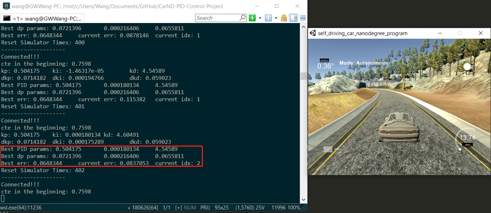
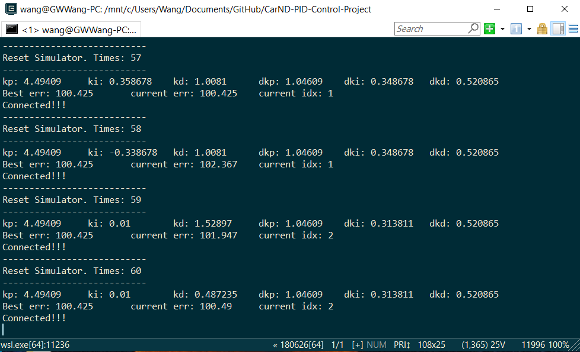
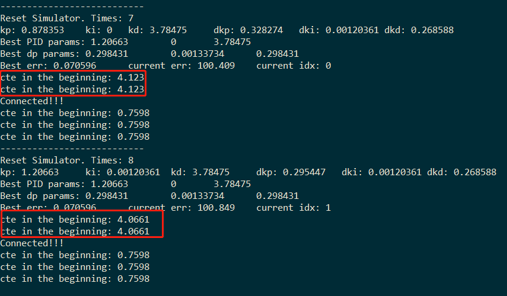

# PID Control Project
Self-Driving Car Engineer Nanodegree Program

---

I implemented a PID controller with C++ for vehicle lane tracking in the simulator. The PID controller's parameters are automatically tuned by twiddle method.

### Results

The performance is not good enough, especially for the curve road tracking, it might be caused by the straight road is mainly used for training PID params at the beginning, and  twiddle is stuck into local minimum. 
The performance can be better with larger running steps, but it would cost much more time. More sophicticated cost function (such as running distance on the track included) might also be useful otherwise using MSE to determine controller's performance. However, it has found PID parameters which can run a full lap. 

The final parameters are shown as following

| PID |   `Kp`  |   `Ki`  |   `Kd`  |
| ---- | ----- | ----- | ----- |
| Initiation | 0.1 | 0.01 | 1 |
| Tuned params  | 0.504175   | 0.000180134 | 4.54589 |

| Twiddle |   `dKp`  |   `dKi`  |   `dKd`  |
| ---- | ----- | ----- | ----- |
| Initiation | 1 | 0.01 | 1 |
| Final params  | 0.0721396 | 0.000216406 | 0.0655811 |

  

Even though the vehicle can run a lap with the previous PID parameters, I modified them manually based on the previous results to gain a robust performance.

The final PID parameters are

| PID |   `Kp`  |   `Ki`  |   `Kd`  |
| ---- | ----- | ----- | ----- |
| Tuned params  | 0.3   | 0.000180134 | 4.54589 |


### Reflection

- I firstly initialized PID parameters  Kp, Ki and Kd with `[0.1, 0.01, 1]` from experience of `Kp = 0.1*Kd, Ki = 0.1*Kp`.

- Then these parameters are tuned with twiddle method with `dp` of `[1, 1, 1]`. However, I found the `dp[1]` is too large for `Ki`. `dp[1]` is always decreasing in the first 60 epochs. Hence, I reinitialized the `dp` with `[1, 0.01, 1]` for converging faster.
  

- After hundreds of simulator restarting, the final result indicates that we can manually set initial PID parameters and using small `dp` to fine tuning them. It would save a lot of time.

### Code snippets

- The following code is used for automatic restarting simulator (found it on forum)
```
void reset_simulator(uWS::WebSocket<uWS::SERVER>& ws) {
  std::string msg("42[\"reset\",{}]");
  ws.send(msg.data(), msg.length(), uWS::OpCode::TEXT);
}
```
- There are some unusual error feedback before simulator connected after using auto reset,  a `if...else` is simply used to remove this.

```
if(n_iter>2)
{
    PID and Twiddle...
}
```
  

- Twiddle method in Python code

```
def twiddle(tol=1e-10): 
    p = [0, 0, 0]
    dp = [1, 1, 1]
    robot = make_robot()
    x_trajectory, y_trajectory, best_err = run(robot, p)
    while best_err > tol:
        for i in range(3):
            p[i] += dp[i]
            robot = make_robot()
            x_trajectory, y_trajectory, err = run(robot, p)
            if err < best_err:
                best_err = err
                dp[i] *= 1.1
            else:
                p[i] -= 2*dp[i]
                robot = make_robot()
                x_trajectory, y_trajectory, err = run(robot, p)
                if err < best_err:
                    best_err = err
                    dp[i] *= 1.1
                else:
                    p[i] += dp[i]
                    dp[i] *= 0.9
    return p, best_err
```

Pseudo Twiddle Code by Sebastian Thrun.


### Build steps

1. Clone this repo.
2. Make a build directory: `mkdir build && cd build`
3. Compile: `cmake .. && make`
4. Run it: `./pid`. 

Alternatively some scripts have been included to streamline this process, these can be leveraged by executing the following in the top directory of the project:

1. ./clean.sh
2. ./build.sh
3. ./run.sh


### Dependencies

* cmake >= 3.5
 * All OSes: [click here for installation instructions](https://cmake.org/install/)
* make >= 4.1(mac, linux), 3.81(Windows)
  * Linux: make is installed by default on most Linux distros
  * Mac: [install Xcode command line tools to get make](https://developer.apple.com/xcode/features/)
  * Windows: [Click here for installation instructions](http://gnuwin32.sourceforge.net/packages/make.htm)
* gcc/g++ >= 5.4
  * Linux: gcc / g++ is installed by default on most Linux distros
  * Mac: same deal as make - [install Xcode command line tools]((https://developer.apple.com/xcode/features/)
  * Windows: recommend using [MinGW](http://www.mingw.org/)
* [uWebSockets](https://github.com/uWebSockets/uWebSockets)
  * Run either `./install-mac.sh` or `./install-ubuntu.sh`.
  * If you install from source, checkout to commit `e94b6e1`, i.e.
    ```
    git clone https://github.com/uWebSockets/uWebSockets 
    cd uWebSockets
    git checkout e94b6e1
    ```

- This project involves the Simulator which can be downloaded [here](https://github.com/udacity/self-driving-car-sim/releases)